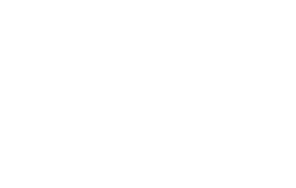
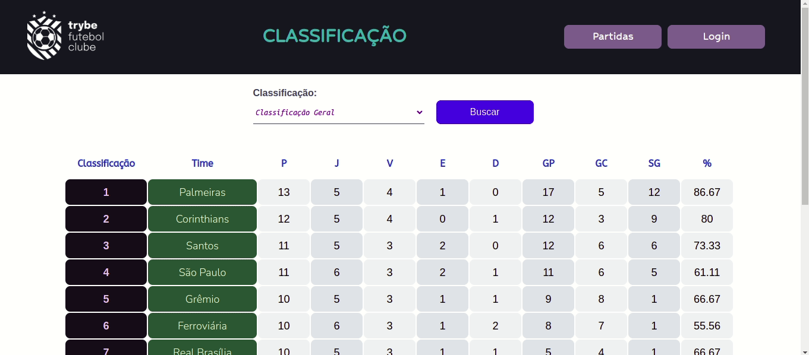

    

⚽ Aplicação responsável pela serie A do campeonato TFC - Trybe Futebol Clube ⚽ Em construção 🚧

• <a href="#-sobre-o-projeto">Sobre</a> •
 <a href="#%EF%B8%8F-funcionalidades">Features</a> • 
 <a href="#-demonstra%C3%A7%C3%A3o">Demonstração</a> • 

## 💻 Sobre o projeto

O TFC é um site informativo sobre partidas e classificações de futebol. Começando pela API, foram desenvolvidos alguns endpoints (seguindo os princípios REST) que estão conectados a um banco de dados.

Esta é uma aplicação dockerizada em Node.js + Typescript usando o pacote sequelize.

## ⚙️ Funcionalidades

- [x] Uma pessoa pode fazer login como admin do site enviando:
  - [x] um email válido
  - [x] uma senha válida

- [x] É possível acessar a tela de partidas e:
  - [x] ver uma lista com todas as partidas
  - [x] filtrar por partidas em andamento
  - [x] filtrar por partidas finalizadas

- [x] O admin pode:
    - [x] inserir partidas, desde que estas não sejam com times iguais ou com times não disponíveis na tabela 
    - [x] adicionar e editar partidas em andamento
    - [x] finalizar partidas em andamento 
    - [x] adicionar partidas finalizadas

- [x] É possível acessar a área de classificação e:
  - [x] ver uma lista da classificação geral dos times
  - [x] ver a classificação dos times quando mandantes
  - [x] ver a classificação dos times quando visitantes 

## 🎨 Demonstração

  

